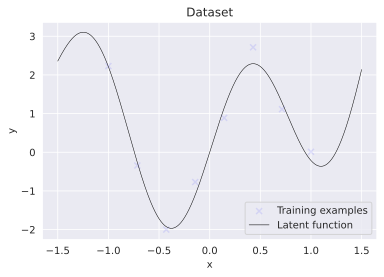
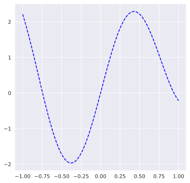

```python
%matplotlib inline
%config InlineBackend.figure_format = 'svg'

import numpy as np
import scipy
import matplotlib
import matplotlib.pyplot as plt
from matplotlib import cm
from mpl_toolkits.axes_grid1 import make_axes_locatable
import matplotlib.gridspec as gridspec
import seaborn as sns
import jax
import jax.numpy as jnp

# Set matplotlib and seaborn plotting style
sns.set_style('darkgrid')
np.random.seed(42)

from gp import gaussian_process
from kernel import kernel_functions, preprocess
#
```


```python
from operator import index
import numpy as np # imports a fast numerical programming library
import scipy as sp #imports stats functions, amongst other things
import matplotlib as mpl # this actually imports matplotlib
import matplotlib.cm as cm #allows us easy access to colormaps
import matplotlib.pyplot as plt #sets up plotting under plt
import pandas as pd #lets us handle data as dataframes
import jax.numpy as jnp # ai-accelerator agnostic numpy implementations
import jax # autograd + XLA
from tensorflow_probability.substrates import jax as tfp # tensorflow probability
import seaborn as sns
import warnings
from kernel import kernel_functions, preprocess
warnings.filterwarnings("ignore")

```


```python
tfd = tfp.distributions
```


    ---------------------------------------------------------------------------

    ImportError                               Traceback (most recent call last)

    /home/progyan.das/models/svgp_jax/svgp.ipynb Cell 3 in <cell line: 1>()
    ----> <a href='vscode-notebook-cell://ssh-remote%2B10.0.62.168/home/progyan.das/models/svgp_jax/svgp.ipynb#X24sdnNjb2RlLXJlbW90ZQ%3D%3D?line=0'>1</a> tfd = tfp.distributions


    File ~/anaconda3/lib/python3.9/site-packages/tensorflow_probability/python/internal/lazy_loader.py:57, in LazyLoader.__getattr__(self, item)
         56 def __getattr__(self, item):
    ---> 57   module = self._load()
         58   return getattr(module, item)


    File ~/anaconda3/lib/python3.9/site-packages/tensorflow_probability/python/internal/lazy_loader.py:44, in LazyLoader._load(self)
         42   self._on_first_access = None
         43 # Import the target module and insert it into the parent's namespace
    ---> 44 module = importlib.import_module(self.__name__)
         45 if self._parent_module_globals is not None:
         46   self._parent_module_globals[self._local_name] = module


    File ~/anaconda3/lib/python3.9/importlib/__init__.py:127, in import_module(name, package)
        125             break
        126         level += 1
    --> 127 return _bootstrap._gcd_import(name[level:], package, level)


    File <frozen importlib._bootstrap>:1030, in _gcd_import(name, package, level)


    File <frozen importlib._bootstrap>:1007, in _find_and_load(name, import_)


    File <frozen importlib._bootstrap>:986, in _find_and_load_unlocked(name, import_)


    File <frozen importlib._bootstrap>:680, in _load_unlocked(spec)


    File <frozen importlib._bootstrap_external>:850, in exec_module(self, module)


    File <frozen importlib._bootstrap>:228, in _call_with_frames_removed(f, *args, **kwds)


    File ~/anaconda3/lib/python3.9/site-packages/tensorflow_probability/substrates/jax/__init__.py:45, in <module>
         43 from tensorflow_probability.python.version import __version__
         44 # from tensorflow_probability.substrates.jax.google import staging  # DisableOnExport  # pylint:disable=line-too-long
    ---> 45 from tensorflow_probability.substrates.jax import bijectors
         46 from tensorflow_probability.substrates.jax import distributions
         47 from tensorflow_probability.substrates.jax import experimental


    ImportError: cannot import name 'bijectors' from partially initialized module 'tensorflow_probability.substrates.jax' (most likely due to a circular import) (/home/progyan.das/anaconda3/lib/python3.9/site-packages/tensorflow_probability/substrates/jax/__init__.py)


```python
gauss = gaussian_process()
prep = preprocess()
```

    reached here


```python
def func(x):
    """Latent function.
    """
    return 1.0 * x**2 + \
           0.3 * x**1 + \
           2 * np.sin(4*x)
```


```python
# Number of training examples
n = 8
# Number of inducing variables
m = 8
# Noise
sigma_y = 0.2

# Noisy training data
X = jnp.linspace(-1.0, 1.0, n).reshape(-1, 1)
y = func(X) + sigma_y * jax.random.normal(jax.random.PRNGKey(0), shape=(n, 1))

# Test data
X_test = np.linspace(-1.5, 1.5, 1000).reshape(-1, 1)
f_true = func(X_test)

# Inducing inputs
X_m = jnp.linspace(-0.4, 0.4, m).reshape(-1, 1)
```

    WARNING:absl:No GPU/TPU found, falling back to CPU. (Set TF_CPP_MIN_LOG_LEVEL=0 and rerun for more info.)


Graph


```python
plt.scatter(X, y, label='Training examples', marker='x', color='blue', alpha=0.1)
plt.plot(X_test, f_true, label='Latent function', c='k', lw=0.5)
plt.title('Dataset')
plt.xlabel('x')
plt.ylabel('y')
plt.legend();
```


    

    


KERNEL AND GP FUNCTIONS


```python
n = 75  # Number of points in posterior (test points)
domain = (-1, 1)
x_linspace = np.linspace(domain[0], domain[1], n).reshape(-1, 1)
```


```python
y_data = y.reshape([y.shape[0]])
```


```python
def mysqrt(n):
    if n.any() < 0:
        return np.zeroes(n.size)
    else:
        return np.sqrt(n)
```


```python
def jitter_matrix(dim_count: int, value = 1e-5):
        """
        Add jitter along diagonals to make sure matrix doesn't become singular.
        Reduces overfitting in many huge-input cases.
        """

        return jnp.eye(dim_count) * value
```


```python
X
```


    DeviceArray([[-1.        ],
                 [-0.71428573],
                 [-0.42857143],
                 [-0.14285707],
                 [ 0.1428572 ],
                 [ 0.42857146],
                 [ 0.71428585],
                 [ 1.        ]], dtype=float32)


```python
mu, cov = gauss.GaussianPosterior(x_data = X, y_data = y_data, x_input = x_linspace) 
sig = mysqrt(np.diag(cov))
# Draw some samples of the posterior
mu.size
cov.size
```


    ---------------------------------------------------------------------------

    ValueError                                Traceback (most recent call last)

    /home/progyan.das/models/svgp_jax/svgp.ipynb Cell 13 in <cell line: 1>()
    ----> <a href='vscode-notebook-cell://ssh-remote%2B10.0.62.168/home/progyan.das/models/svgp_jax/svgp.ipynb#X15sdnNjb2RlLXJlbW90ZQ%3D%3D?line=0'>1</a> mu, cov = gauss.GaussianPosterior(x_data = X, y_data = y_data, x_input = x_linspace) 
          <a href='vscode-notebook-cell://ssh-remote%2B10.0.62.168/home/progyan.das/models/svgp_jax/svgp.ipynb#X15sdnNjb2RlLXJlbW90ZQ%3D%3D?line=1'>2</a> sig = mysqrt(np.diag(cov))
          <a href='vscode-notebook-cell://ssh-remote%2B10.0.62.168/home/progyan.das/models/svgp_jax/svgp.ipynb#X15sdnNjb2RlLXJlbW90ZQ%3D%3D?line=2'>3</a> # Draw some samples of the posterior


    File ~/models/svgp_jax/gp.py:106, in gaussian_process.GaussianPosterior(self, x_data, y_data, x_input)
        103 mu = np.dot(L.T, np.linalg.solve(L, y_data))    
        105 K_ = self.kernel_function(x_input, x_input)             
    --> 106 s2 = np.diag(K_) - np.sum(L**2, axis=0)   
        107 s = np.sqrt(s2)
        109 return mu, s2


    ValueError: operands could not be broadcast together with shapes (75,) (8,) 


```python
y_out = np.random.multivariate_normal(mean=mu, cov=cov, size=10)
```


    ---------------------------------------------------------------------------

    NameError                                 Traceback (most recent call last)

    /home/progyan.das/models/svgp_jax/svgp.ipynb Cell 14 in <cell line: 1>()
    ----> <a href='vscode-notebook-cell://ssh-remote%2B10.0.62.168/home/progyan.das/models/svgp_jax/svgp.ipynb#X16sdnNjb2RlLXJlbW90ZQ%3D%3D?line=0'>1</a> y_out = np.random.multivariate_normal(mean=mu, cov=cov, size=10)


    NameError: name 'mu' is not defined


```python
kernel_functions.rbf_kernel(X,X)
```


    DeviceArray([[1.        , 0.96000546, 0.84936583, 0.69256926, 0.5204501 ,
                  0.3604478 , 0.23006624, 0.13533528],
                 [0.96000546, 1.        , 0.96000546, 0.8493658 , 0.69256926,
                  0.5204501 , 0.3604477 , 0.2300663 ],
                 [0.84936583, 0.96000546, 1.        , 0.9600054 , 0.84936583,
                  0.6925693 , 0.52045006, 0.3604478 ],
                 [0.69256926, 0.8493658 , 0.9600054 , 1.        , 0.96000546,
                  0.84936583, 0.69256926, 0.5204502 ],
                 [0.5204501 , 0.69256926, 0.84936583, 0.96000546, 1.        ,
                  0.96000546, 0.8493658 , 0.6925694 ],
                 [0.3604478 , 0.5204501 , 0.6925693 , 0.84936583, 0.96000546,
                  1.        , 0.9600054 , 0.84936583],
                 [0.23006624, 0.3604477 , 0.52045006, 0.69256926, 0.8493658 ,
                  0.9600054 , 1.        , 0.96000546],
                 [0.13533528, 0.2300663 , 0.3604478 , 0.5204502 , 0.6925694 ,
                  0.84936583, 0.96000546, 1.        ]], dtype=float32)


```python
# Plot the postior distribution and some samples
fig, (ax1) = plt.subplots(
    nrows=1, ncols=1, figsize=(6, 6))
# Plot the distribution of the function (mean, covariance)
ax1.plot(x_linspace, func(x_linspace), 'b--', label='$sin(x)$')
ax1.fill_between(x_linspace.flat, mu-2*0.5, mu+2*0.5, color='red', 
                 alpha=0.15, label='$2 \sigma_{2|1}$')
ax1.plot(x_linspace, mu, 'r-', lw=2, label='$\mu_{2|1}$')
ax1.plot(X, y, 'ko', linewidth=2, label='$(x_1, y_1)$')
ax1.set_xlabel('$x$', fontsize=13)
ax1.set_ylabel('$y$', fontsize=13)
ax1.set_title('Distribution of posterior and prior data.')
ax1.axis([-1, 1, -3, 3])
```


    ---------------------------------------------------------------------------

    NameError                                 Traceback (most recent call last)

    /home/progyan.das/models/svgp_jax/svgp.ipynb Cell 15 in <cell line: 6>()
          <a href='vscode-notebook-cell://ssh-remote%2B10.0.62.168/home/progyan.das/models/svgp_jax/svgp.ipynb#X20sdnNjb2RlLXJlbW90ZQ%3D%3D?line=3'>4</a> # Plot the distribution of the function (mean, covariance)
          <a href='vscode-notebook-cell://ssh-remote%2B10.0.62.168/home/progyan.das/models/svgp_jax/svgp.ipynb#X20sdnNjb2RlLXJlbW90ZQ%3D%3D?line=4'>5</a> ax1.plot(x_linspace, func(x_linspace), 'b--', label='$sin(x)$')
    ----> <a href='vscode-notebook-cell://ssh-remote%2B10.0.62.168/home/progyan.das/models/svgp_jax/svgp.ipynb#X20sdnNjb2RlLXJlbW90ZQ%3D%3D?line=5'>6</a> ax1.fill_between(x_linspace.flat, mu-2*0.5, mu+2*0.5, color='red', 
          <a href='vscode-notebook-cell://ssh-remote%2B10.0.62.168/home/progyan.das/models/svgp_jax/svgp.ipynb#X20sdnNjb2RlLXJlbW90ZQ%3D%3D?line=6'>7</a>                  alpha=0.15, label='$2 \sigma_{2|1}$')
          <a href='vscode-notebook-cell://ssh-remote%2B10.0.62.168/home/progyan.das/models/svgp_jax/svgp.ipynb#X20sdnNjb2RlLXJlbW90ZQ%3D%3D?line=7'>8</a> ax1.plot(x_linspace, mu, 'r-', lw=2, label='$\mu_{2|1}$')
          <a href='vscode-notebook-cell://ssh-remote%2B10.0.62.168/home/progyan.das/models/svgp_jax/svgp.ipynb#X20sdnNjb2RlLXJlbW90ZQ%3D%3D?line=8'>9</a> ax1.plot(X, y, 'ko', linewidth=2, label='$(x_1, y_1)$')


    NameError: name 'mu' is not defined


    

    


```python

```
